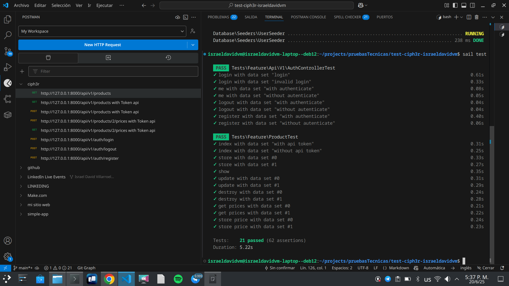

# api-productos

## ¡Optimiza tu API de productos con api-productos!

¿Necesitas una API robusta y eficiente para gestionar tus productos? Con api-productos, obtén una solución completa para crear, leer, actualizar y eliminar productos, junto con la gestión de monedas y precios. ¡Prueba nuestra API y lleva tu gestión de productos al siguiente nivel!

## Licencia

Este código tiene licencia bajo la licencia pública general de GNU versión 3.0 o posterior (LGPLV3+). Puedes encontrar una copia completa de la licencia en https://www.gnu.org/licenses/lgpl-3.0-standalone.html

## Características ¿Qué te ofrece api-productos?

api-productos es una API integral diseñada para gestionar productos, monedas y precios de manera eficiente. Ofrece un conjunto de funcionalidades avanzadas que incluyen:

* **Gestión de Productos:**
    * Creación, lectura, actualización y eliminación de productos.
    * Soporte para descripción, precio, costo de impuestos y costo de fabricación.
    * Relación con monedas para gestionar precios en diferentes divisas.
* **Gestión de Monedas:**
    * Creación, lectura, actualización y eliminación de monedas.
    * Soporte para nombre, símbolo y tipo de cambio.
* **Gestión de Precios de Productos:**
    * Gestión de precios de productos en diferentes monedas.
    * Relación con productos y monedas.
* **API RESTful:**
    * Endpoints claros y bien definidos para todas las operaciones.
    * Respuestas en formato JSON.
* **Validación de datos:**
    * Validacion de todos los datos introducidos.

Con api-productos, podrás garantizar una gestión de productos sólida, eficiente y libre de errores comunes.

## Características a implementar

## Uso

### Requisitos 

Tener instalado 
- php
- composer
- Docker

### Instalacion 

Ejecuta el comando para instalar laravel sail, sactum y las demas depencias

composer install  

#### Docker
El proceso de instalacion esta gestionado por laravel sail mas concretamente por medio de docker-compose.yml

Eres libre de modificar dicho archivo a tu gusto

### Configuracinon y activacion del servidor

#### Archivo .env 

Establece una configuracion en el archivo .env. como la siguiente

```
DB_CONNECTION=<DBConnection>
DB_HOST=<Host>
DB_PORT=<Port>
DB_DATABASE=<DatabaseName>
DB_USERNAME=<UserName>
DB_PASSWORD=<Password>

En caso de querer usar postgresql

DB_CONNECTION=pgsql
DB_HOST=pgsql
DB_PORT=5432
DB_DATABASE=<DatabaseName>
DB_USERNAME=<UserName>
DB_PASSWORD=<password>

```

#### Activar servidor
Ejecuta el comando

sail up

#### Ejecuta migraciones
sail artisan migrate:refresh --seed


### Accede a la documentacion de la api

Utilizando la url generada por la configuracion de docker

en este caso http://127.0.0.1:8000 

accede a la documentacion de la api

por medio de la url

http://127.0.0.1:8000/api/documentation


#### Acceso a la api 

Para tener acceso a la api debes de logearte con un usuario. 
Para pruebas con la api se creo un usuario con las siguientes credenciales
un email "israeldavidvm@gmail.com" y password de "Password1234."


#### Consume la api

Puedes acceder a la api por medio de tu cliente http/https favorito postman, curl etc 

#### consumo de la api mediante swagger


#### consumo de la api mediante postman


## Planificación, Ingeniería de Requerimientos y Gestión de Riesgos

Estas secciones del proyecto se llevarán a cabo mediante un sitio en Notion, de forma que puedan ser fácilmente accesibles por el personal no técnico.

Solicita el link de acceso al personal autorizado.

## Diseño de Software

### Perspectiva Estructural

#### Vista Lógica de la Arquitectura del Software


### Perspectiva de comportamiento

### Diseño de Base de Datos


## Desiciones tecnicas

Con el objetivo de estandarizar el comportamiento de varios de los modelos se definio el trait israeldavidvm/eloquent-traits/src/AttributesTrait.php

El cual trae 2 metodos consigo el

abstract public static function validateAttributes(array $arrayAttributes): ?MessageBag;

Que permite validar los attributos que se van a asignar a un modelo, no repetir la logica y no depender de una Form Request Validation, cosa ventajosa en caso de querer crear una vista utilizando tecnologias como livewire o fillament

abstract public function initAttributes(array $arrayAttributes);

Que permite encapsular la logica de inicializacion de attributos para un modelo


## Verification and Validation / Validacion y Verificacion

# Ejecucion de test
```
sail test
```

